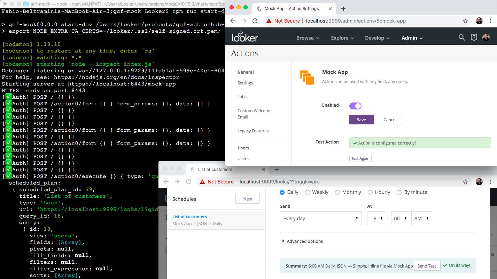

# Simple Mock ActionHub for local or serverless (GCF) use

## Local deployment with local Looker instance

See `gcf-mock/README.md`

## Cloud Deployment to Google Cloud Functions

More details to come. Here's the gist:

1. Deploy Action to Google Cloud Functions
	- Specify `action` as the directory where the function/module is defined
	- Specify `httpHandler` as the exported function to call
	- Environment variables
		- CALLBACK_URL_PREFIX (e.g. `https://<region>-<project>.cloudfunctions.net/<function>`)
		- EXPECTED_LOOKER_SECRET_TOKEN (choose any random string)
2. Configure Looker instance
	- /admin/actions
		- Enter the expected secret token from step 1